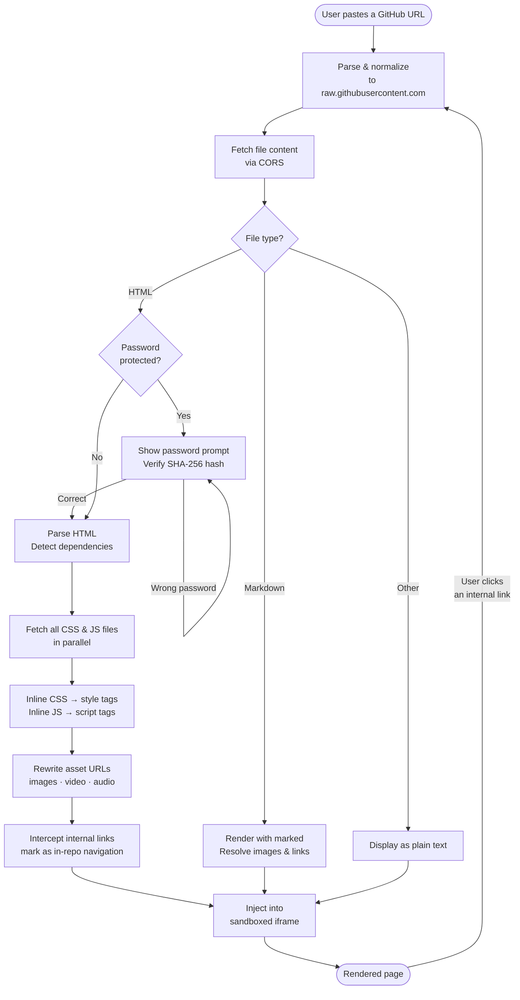

<div align="center">

# 🌐 GitHub File Renderer

**Render any GitHub file in the browser — HTML, Markdown, CSS, XML and more.**
No backend. No setup. Just paste a URL.

[](https://patchamama.github.io/GitHub-File-Renderer/)
[](LICENSE)
[](https://react.dev)
[](https://www.typescriptlang.org)

🔗 **[https://patchamama.github.io/GitHub-File-Renderer/](https://patchamama.github.io/GitHub-File-Renderer/)**

</div>

---

## Why

GitHub's built-in viewer only shows raw source or a bare-bones preview — it was never designed to render full web pages. This means that **many GitHub repositories hosting HTML websites have no way to be previewed without deploying them elsewhere first**. If you want to see how the site actually looks, you'd normally need to clone the repo, install dependencies, and run a local server.

**GitHub File Renderer solves that in one step**: paste the GitHub URL, and the page renders exactly as intended — with styles, scripts, images and navigation all working.

- 🖼 HTML files render with CSS and JavaScript fully loaded
- 📝 Markdown renders with images and clickable links
- 🔗 Navigation between pages in the same repository works transparently
- 🔒 Password-protected pages (SHA-256 hash pattern) prompt for a password before rendering

---

## How it works



1. The URL is parsed and normalized to a `raw.githubusercontent.com` address
2. The file is fetched — CORS is permitted by GitHub's raw content server
3. **For HTML files:**
   - All `<link rel="stylesheet">` and `<script src>` references are detected
   - Each dependency is fetched and **inlined** directly into the document
     _(required because GitHub's raw server responds with `Content-Type: text/plain` and a restrictive CSP, which prevents the browser from loading external resources from within an iframe)_
   - Image, video and audio `src` attributes are rewritten to absolute raw URLs
   - Internal links to other files in the same repo are intercepted and trigger a new render cycle instead of navigating away
4. **For Markdown files:** rendered via `marked` with a custom renderer that resolves images and repo-internal links
5. The final self-contained document is injected into a sandboxed `<iframe>`

---

## Supported URL formats

```
# GitHub blob URL (copy directly from the browser address bar)
https://github.com/owner/repo/blob/branch/path/to/file.html

# Raw URL — refs/heads style
https://raw.githubusercontent.com/owner/repo/refs/heads/branch/path/to/file.html

# Raw URL — direct
https://raw.githubusercontent.com/owner/repo/branch/path/to/file.html
```

---

## Examples

| Type | URL |
|------|-----|
| HTML site with CSS + JS | `https://github.com/patchamama/Hapkido-Taekwondo-Trainingsvideos/blob/main/index.html` |
| Password-protected HTML | `https://github.com/patchamama/Hapkido-Taekwondo-Trainingsvideos/blob/main/docs/index.html` |
| Markdown with image links | `https://github.com/patchamama/Hapkido-Taekwondo-Trainingsvideos/blob/main/README.md` |

---

## Supported file types

| Extension | How it renders |
|-----------|----------------|
| `.html`, `.htm` | Full render — inlined CSS/JS, resolved assets, in-repo link navigation |
| `.md`, `.markdown` | Rendered with `marked` — images and links resolved to raw GitHub URLs |
| `.css` | Displayed as plain text |
| `.xml` | Displayed as plain text |
| Everything else | Displayed as plain text |

---

## Tech stack

| Tool | Purpose |
|------|---------|
| React 19 + TypeScript | UI framework |
| Vite | Build tool |
| Tailwind CSS + Typography plugin | Styling |
| TanStack Query | Fetching and caching remote files |
| `marked` | Markdown rendering |
| Web Crypto API (`crypto.subtle`) | SHA-256 password verification |
| GitHub Actions | Automated deployment to GitHub Pages |

---

## Local development

```bash
# Install dependencies
npm install

# Start dev server
npm run dev
# → http://localhost:5173/
```

```bash
# Production build (outputs to docs/)
npm run build

# Preview the production build locally
npm run preview
```

---

## Deployment

The app builds to the `docs/` folder. GitHub Pages serves it directly from that folder on the `main` branch.

**To deploy your own fork:**

1. Fork this repository and push your changes
2. Go to **Settings → Pages**
3. Set **Source** to `Deploy from a branch` → `main` → `/docs`
4. Your site will be live at `https://<your-username>.github.io/<repo-name>/`

Alternatively, the included `.github/workflows/deploy.yml` supports deploying via **GitHub Actions** (Settings → Pages → Source: GitHub Actions).

---

## Known limitations

| Limitation | Details |
|------------|---------|
| Private repositories | Not supported — only public repos are accessible via `raw.githubusercontent.com` |
| Binary files | Images in HTML load fine via absolute URL; binary files opened directly render as plain text |
| Large files | Content is fetched entirely client-side; very large HTML files may be slow |
| CSS `@import` | Inlined CSS files do not yet recursively resolve their own `@import` statements |

---

## Roadmap

- [ ] Recursive `@import` resolution inside fetched CSS files
- [ ] Syntax highlighting for plain text / code files (CSS, XML, JS, etc.)
- [ ] Dark / light mode toggle
- [ ] Copy shareable link button
- [ ] Branch or tag selector
- [ ] Handle CSS injected dynamically via JavaScript
- [ ] Navigation breadcrumb showing the current file path within the repo
- [ ] Support for GitHub Gists

---

## License

[MIT](LICENSE)
